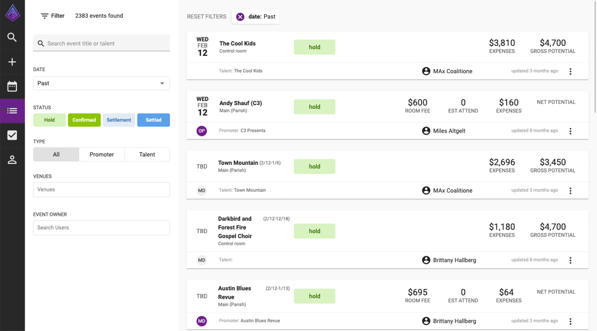
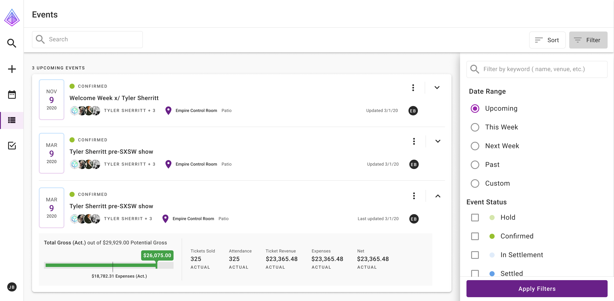
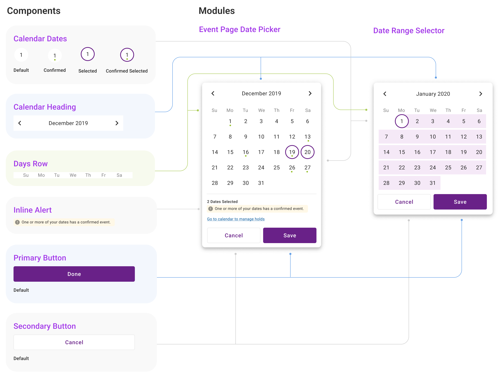
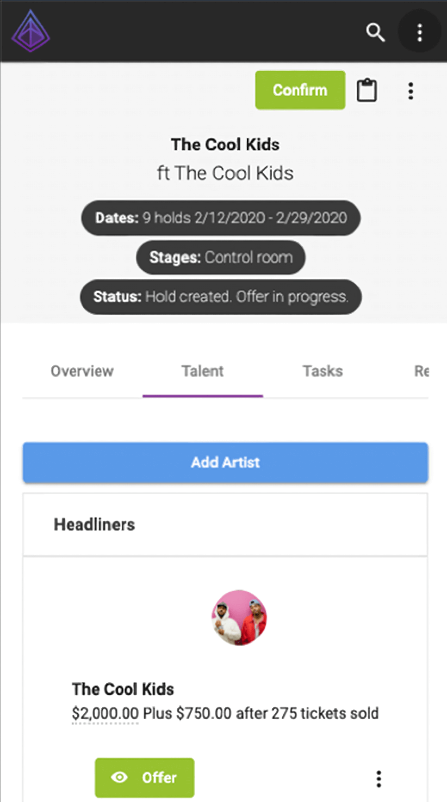
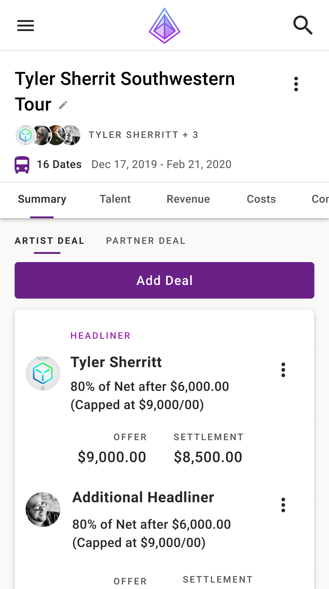
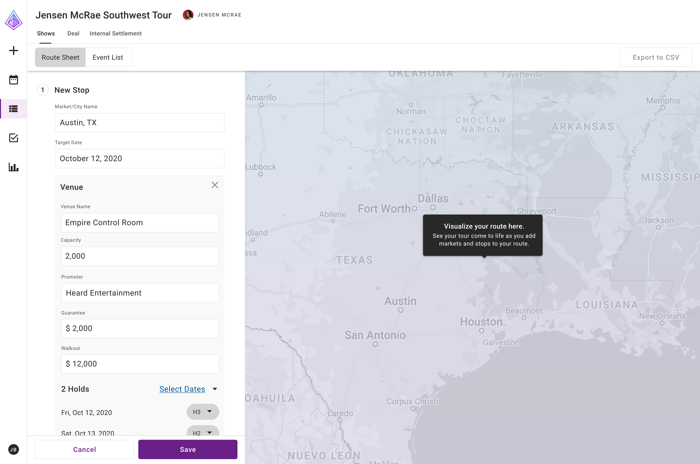
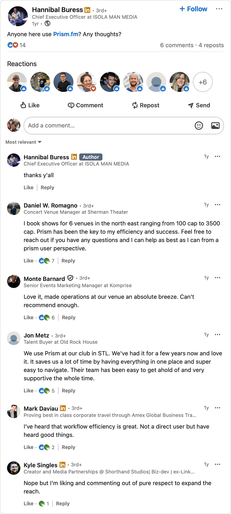

## Background
Prism.fm is a SaaS product for managing live events. As Prism’s first designer, I inherited a complex product serving multiple user types, including talent buyers, venues, promoters, and agents, with no real design standards or documentation. The software handled intricate financial records, contract generation, and event management, but lacked visual consistency and had accumulated significant UX debt, creating cognitive overhead for users navigating already complex workflows.

I made the case to leadership to establish a scalable design system and introduce foundational design operations. I collaborated closely with product management and engineers to define new workflows and implement a shared design language rooted in modern best practices.

### Before

<figure class="case-figure">
  
  <figcaption>The legacy events list also doubled as a pseudo-dashboard meant to provide an overview of event financial performance, although the information provided was not always intuitive. This came with the tradeoff of being unable to quickly find and navigate to an event.</figcaption>
</figure>

### After
<figure class="case-figure">
  
  <figcaption>Redesigned events list using the new design system. Users can quickly scan to find events expand a specific event to see event financials at a glance.</figcaption>
</figure>

## Approach
- Interviewed stakeholders to identify pain points and inefficiencies
- Conducted a full UX/UI audit across the product
- Developed and maintained a new design language system
- Introduced standardized documentation and component libraries as well as weekly design reviews

## Design Strategy
To address these issues, I focused on creating a modular, scalable system that prioritized clarity, consistency, and developer alignment.

**Key Principles**
- **Atomic Design:** Introduced a component-based design framework to encourage reusability and maintainability
- **Complexion Reduction:** Simplified visual hierarchy by minimizing unnecessary decoration and emphasizing content
- **Material Design:** Leveraged Material Angular components already in use by developers to reduce build time and ensure consistency
These changes were implemented iteratively across product sprints, allowing the new design language to evolve alongside legacy systems without requiring a full redesign upfront.

<figure class="case-figure">
  
  <figcaption>Anatomy of a date picker. There are two use cases being shown here. One, talent buyers are often juggling multiple events on the same day, making it important to see at a glance which dates already have confirmed events. The other is a generic date range selector for filtering events.</figcaption>
</figure>

## Early Observations
Initial conversations revealed a developer-centric culture where user needs were not always front and center. There were no shared processes for creating or maintaining design patterns, and no single source of truth for design decisions. The absence of UX documentation led to inconsistencies across UI elements, navigation patterns, and workflows.

A design audit confirmed these findings. For example, the app had nearly a dozen variations of primary buttons, each with different shapes, colors, and interactions. This inconsistency contributed to visual clutter, cognitive overload, and inefficient development cycles.

## Execution
Rather than pursuing a wholesale redesign, I implemented changes incrementally across sprint cycles. This approach allowed the new design language to coexist with legacy elements while progressively updating the experience.

**Key Wins**
- Consolidating and standardizing component variations based on design best practices
- Establishing consistent color, typography, and spacing systems
- Creating component documentation that bridged design and development
- Redesigning high-impact pages like event lists and detail pages

### Before
<figure class="case-figure">
  
  <figcaption>Mobile event detail pages were cluttered and lacked clear visual hierarchy.</figcaption>
</figure>

### After
<figure class="case-figure">
  
  <figcaption>Redesigned mobile event detail page using new design language system. This updated design is much more information-dense than the “before” example as the product’s capabilities continued to grow.</figcaption>
</figure>

## Impact
The design system implementation delivered measurable improvements:
- Reduced UI inconsistencies and visual clutter
- Cut delivery time for new features and reduced design-to-development translation issues
- Improved user satisfaction, with customers proactively sharing positive feedback
- Supported business growth through the pandemic, contributing to 115% revenue increase and successful Series A funding

<figure class="case-figure">
  
  <figcaption>An MVP concept for tour management, demonstrating that Material 2.0 didn’t have to be completely boring.</figcaption>
</figure>

This foundational work established design operations that scaled with the company’s growth and demonstrated the strategic value of systematic design thinking in early-stage product development.

Users regularly shared positive feedback following design updates, and the improved product experience contributed to major business outcomes, including $1.3M in revenue during a pandemic year and <a href="https://prism.fm/blog/product-updates-news/prism-announces-8-million-series-a-funding/" target="_blank" rel="noopener noreferrer">a successful $8M Series A (opens in new tab)</a>.

<figure class="case-figure">
  
  <figcaption>Turns out, Hannibal Buress is familiar with my work.</figcaption>
</figure>

> *“Jesse approaches his work with more thoughtfulness than most. He greatly improved our entire company culture by asking tough questions and putting the customer at the center of everything we did.”*
>
> **<a href="https://www.linkedin.com/in/katehrdina/" target="_blank" rel="noopener noreferrer">Kate Hrdina (opens in new tab)</a>, Product Manager, Prism.fm**
